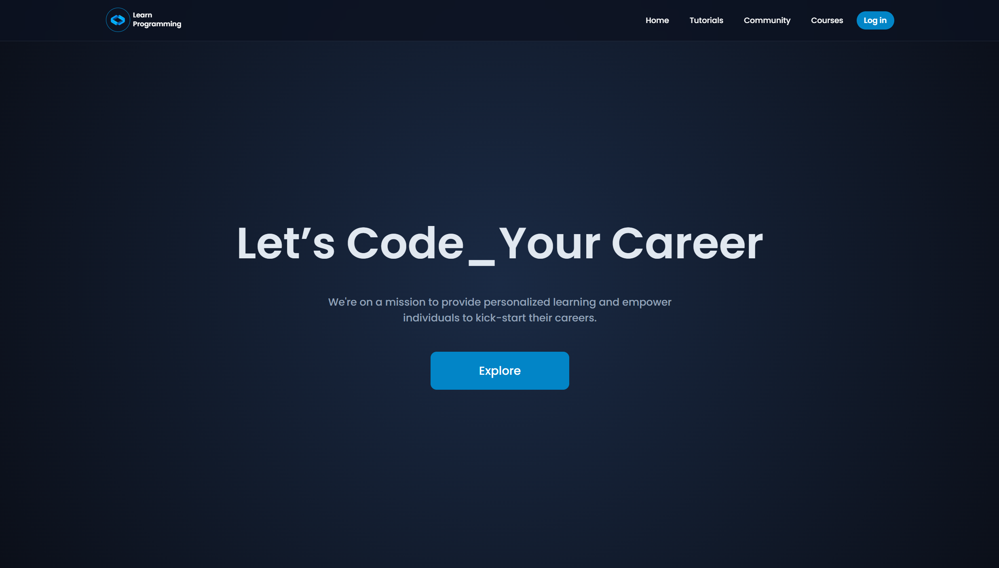

<div align="center">

# 🎓 E-Learning Design

A clean, modern, and fully responsive e-learning platform UI — built with **pure HTML & CSS**.

[](https://developer.mozilla.org/en-US/docs/Web/HTML)
[](https://developer.mozilla.org/en-US/docs/Web/CSS)
[](#-responsive-design)

[Live Demo](https://dipu-ray.github.io/e-learning-design/) · [GitHub](https://github.com/dipu-ray) · [LinkedIn](https://www.linkedin.com/in/dipu-ray/)

</div>

---

**Started:** 16 April, 2026  
**Last Updated:** 22 June, 2026  
**Author:** Dipu Ray

---

## 📖 Overview

**E-Learning Design** is a minimal, elegant, and fully responsive e-learning platform interface built entirely with **HTML5** and **CSS3** — no frameworks, no JavaScript, no dependencies. It's designed to be lightweight, easy to understand, and simple to integrate into any web project as a starting point for online learning and course-based UIs.

This project is ideal for developers who want a clean e-learning template to learn from, customize, or plug directly into their own applications — whether it's a course marketplace, a student dashboard, or a learning management system (LMS) front end.

---

## ✨ Features

- 🎨 **Modern, minimal UI** with a clean visual hierarchy
- 📚 **Course-focused layout** — cards, categories, and progress sections
- 📱 **Fully responsive** — looks great on mobile, tablet, and desktop
- ⚡ **Pure HTML & CSS** — no JavaScript or external libraries required
- 🧩 **Semantic HTML structure** for accessibility and SEO
- 🪶 **Lightweight & fast** — no build tools or dependencies needed
- 🛠️ **Easy to customize** — well-organized CSS for quick theming
- 🌐 **Cross-browser compatible**

---

## 🖼️ Preview

<div align="center">
  
</div>

---

## 🗂️ Project Structure

```
e-learning-design/
│
├── assets/                 # Static files
│   └── images/             # Images & logo
│   └── project-demo/       # Project preview
│   └── svg/                # Icons or SVG
├── README.md               # Project documentation
├── index.html              # Main e-learning page markup
└── style.css               # All styling and responsive layout
```

---

## 🛠️ Built With

- **HTML5** — Semantic page structure
- **CSS3** — Flexbox / Grid layout, custom properties, media queries

---

<div align="center">

If you found this project helpful, please consider giving it a ⭐ — it helps a lot!

</div>
